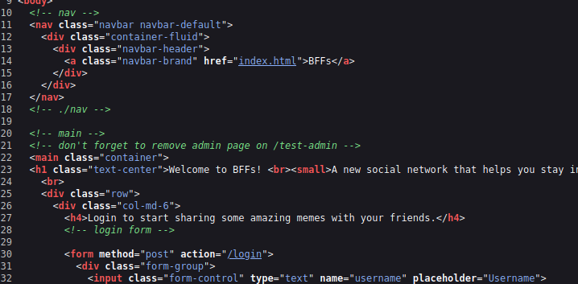
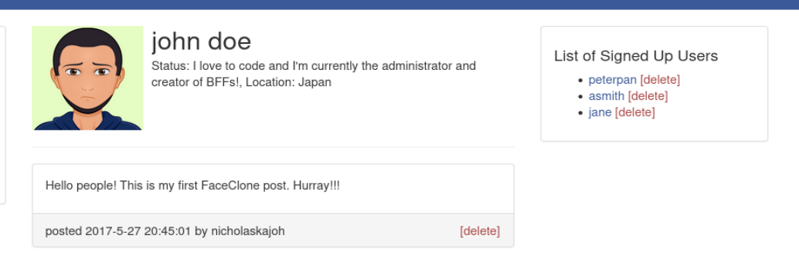

# Getting Started - TryHackMe

Get started with TryHackMe by hacking a fake social media website!

## Overview

- **Room URL:** [https://tryhackme.com/room/gettingstarted](https://tryhackme.com/room/gettingstarted)
- **Difficulty:** Easy
- **Time to complete:** 45

## Walkthrough

### 1. Introduction

- What is the name of the hidden admin page?
- Click `View page source` and you should see a comment:

**=> Answer: `/test-admin`**

### 2. Default Credentials

- 
What is the username and password in the form username:password?

**=> Answer: `admin:admin`**

- 
How many user are signed up to the application?

**=> Answer: `3`**

### 3. Conclusion

_No answer needed!_
