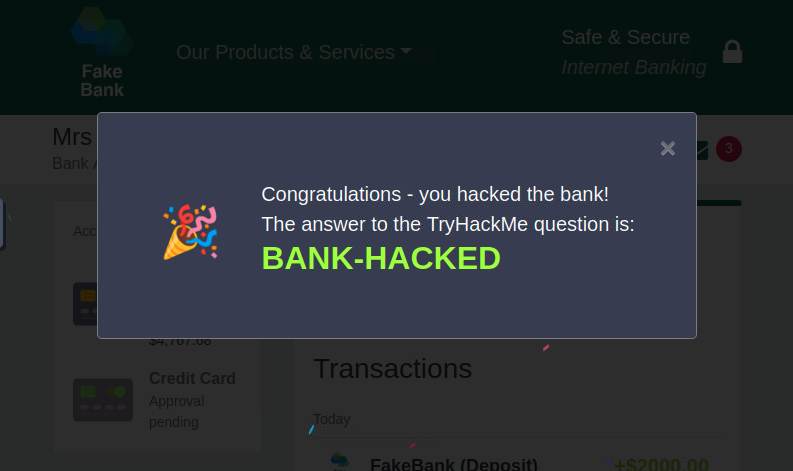

# Offensive Security Intro - TryHackMe

Hack your first website (legally in a safe environment) and experience an ethical hacker's job.

## Overview

- **Room URL:** [https://tryhackme.com/room/offensivesecurityintrokK](https://tryhackme.com/room/offensivesecurityintrokK)
- **Difficulty:** Easy
- **Time to complete:** 15

## Walkthrough

### 1. What is Offensive Security?

- 
Which of the following options better represents the process where you simulate a hacker's actions to find vulnerabilities in a system? 
<ul><li>Offensive Security</li><li>Defensive Security</li></ul>

**=> Answer: `Offensive Security`**

### 2. Starting the Lab

- 
What is your bank account number in the FakeBank web application?

**=> Answer: `8881`**

### 3. Your First Hack

- 
Dirb should have found 2 hidden URLs. One of them is <code>http://fakebank.thm/images</code>. What is the other one?

**=> Answer: `http://fakebank.thm/bank-deposit`**

### 4. Adding Funds to Your Account

- 
If your balance is now positive, a pop-up should appear with some green words in it. Input the green words as the answer to this question (all in uppercase).

(You may need to hit Refresh if you closed the pop-up already) 

**=> Answer: `BANK-HACKED`**
