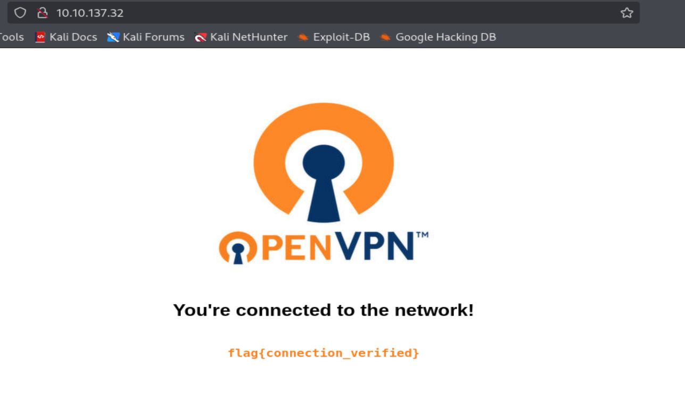

# OpenVPN - TryHackMe

A guide to connecting to our network using OpenVPN.

## Overview

- **Room URL:** [https://tryhackme.com/room/openvpn](https://tryhackme.com/room/openvpn)
- **Difficulty:** Easy
- **Time to complete:** 45

## Walkthrough

### 1. Connecting to our network

_No answer needed!_

### 2. Connecting with Windows

_No answer needed!_

### 3. Connecting with MacOS

_No answer needed!_

### 4. Connecting with Linux

_No answer needed!_

### 5. Using TryHackMe without a VPN

_No answer needed!_

### 6. Check you're connected

- <p>What is the flag displayed on the deployed machine's website?</p>
- On Kali machine:

```
sudo openvpn ./<name>.opvn
```

- Visit `http://<MACHINE_IP>` to get the flag:



**=> Answer: `flag{connection_verified}`**
