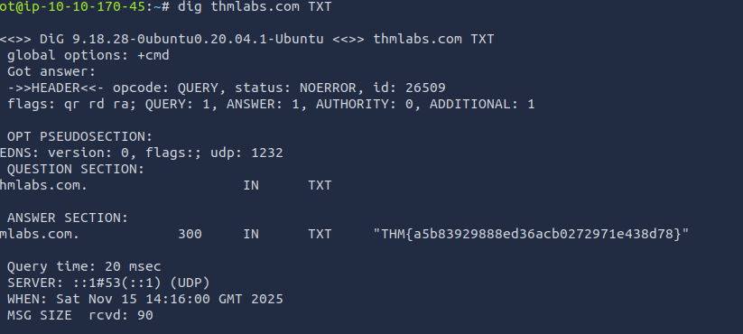
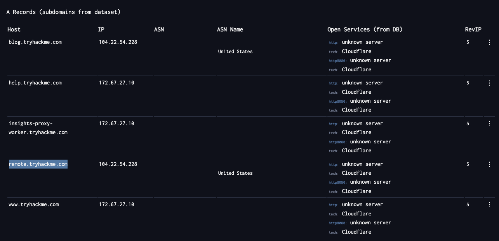

# Passive Reconnaissance - TryHackMe

Learn about the essential tools for passive reconnaissance, such as whois, nslookup, and dig.

## Overview

- **Room URL:** [https://tryhackme.com/room/passiverecon](https://tryhackme.com/room/passiverecon)
- **Difficulty:** Easy
- **Time to complete:** 60

## Walkthrough

### 1. Introduction

_No answer needed!_

### 2. Passive Versus Active Recon

- You visit the Facebook page of the target company, hoping to get some of their employee names. What kind of reconnaissance activity is this? (A for active, P for passive)<br />

**=> Answer: `P`**

- <p>You ping the IP address of the company webserver to check if ICMP traffic is blocked. What kind of reconnaissance activity is this? (A for active, P for passive)<br /></p>

**=> Answer: `A`**

- <p>You happen to meet the IT administrator of the target company at a party. You try to use social engineering to get more information about their systems and network infrastructure. What kind of reconnaissance activity is this? (A for active, P for passive)<br /></p>

**=> Answer: `A`**

### 3. Whois

- When was TryHackMe.com registered?<br />

**=> Answer: `20180705`**

- <p>What is the registrar of TryHackMe.com?<br /></p>

**=> Answer: `namecheap.com`**

- <p>Which company is TryHackMe.com using for name servers?<br /></p>

**=> Answer: `cloudflare.com`**

### 4. nslookup and dig

- <div>Check the TXT records of thmlabs.com. What is the flag there?</div>

```bash
dig thmlabs.com TXT
```



**=> Answer: `THM{a5b83929888ed36acb0272971e438d78}`**

### 5. DNSDumpster

- Lookup tryhackme.com on DNSDumpster. What is one interesting subdomain that you would discover in addition to www and blog?



**=> Answer: `remote`**

### 6. Shodan.io

- <p>According to Shodan.io, what is the first country in the world in terms of the number of publicly accessible Apache servers?</p>

**=> Answer: `United States`**

- <p>Based on Shodan.io, what is the 3rd most common port used for Apache?<br /></p>

**=> Answer: `8080`**

- <p>Based on Shodan.io, what is the 3rd most common port used for nginx?<br /></p>

**=> Answer: `888`**

### 7. Summary

_No answer needed!_
