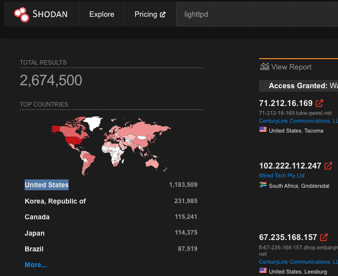
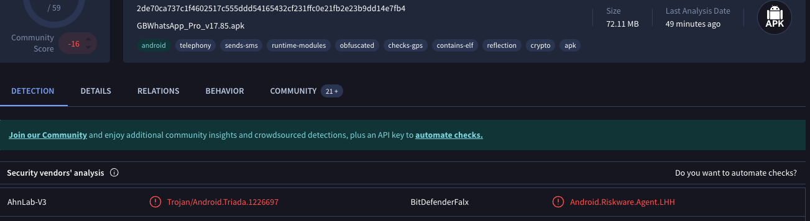

# Search Skills - TryHackMe

Learn to efficiently search the Internet and use specialized search engines and technical docs.

## Overview

- **Room URL:** [https://tryhackme.com/room/searchskills](https://tryhackme.com/room/searchskills)
- **Difficulty:** Easy
- **Time to complete:** 60

## Walkthrough

### 1. Introduction

_No answer needed!_

### 2. Evaluation of Search Results

- What do you call a cryptographic method or product considered bogus or fraudulent?

**=> Answer: `snake oil`**

- What is the name of the command replacing <code>netstat</code> in Linux systems?

**=> Answer: `ss`**

### 3. Search Engines

- How would you limit your Google search to PDF files containing the terms <strong>cyber warfare report</strong>?

**=> Answer: `filetype:pdf cyber warfare report`**

- What phrase does the Linux command <code>ss</code> stand for?

**=> Answer: `socket statistics`**

### 4. Specialized Search Engines

- 
What is the top country with <b>lighttpd</b> servers?

**=> Answer: `United States`**

- What does BitDefenderFalx detect the file with the hash <code>2de70ca737c1f4602517c555ddd54165432cf231ffc0e21fb2e23b9dd14e7fb4</code> as?

**=> Answer: `Android.Riskware.Agent.LHH`**

### 5. Vulnerabilities and Exploits

- What utility does CVE-2024-3094 refer to?

**=> Answer: `xz`**

### 6. Technical Documentation

- What does the Linux command <code>cat</code> stand for?

**=> Answer: `concatenate`**

- What is the <code>netstat</code> parameter in MS Windows that displays the executable associated with each active connection and listening port?

**=> Answer: `-b`**

### 7. Social Media

- You are hired to evaluate the security of a particular company. What is a
  popular social media website you would use to learn about the technical
  background of one of their employees?

**=> Answer: `LinkedIn`**

- Continuing with the previous scenario, you are trying to find the answer
  to the secret question, “Which school did you go to as a child?”. What
  social media website would you consider checking to find the answer to
  such secret questions?

**=> Answer: `Facebook`**

### 8. Conclusion

_No answer needed!_
