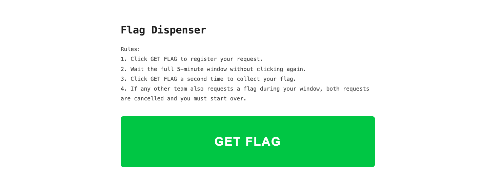

# Crab Mentality — Pico CTF 2026

> **Room / Challenge:** Crab Mentality (Web)

---

## Metadata

- **CTF:** Pico CTF 2026
- **Challenge:** Crab Mentality (web)
- **Target / URL:** `challenge.utctf.live:5888`

---

## Goal

Forgot the crab mentality to get the flag.

## My Solution

The home page:

Based on the rules, we can just get the flag if in 5 minutes other teams don't interupt our waiting request (of course it is impossible). View the page source we get a comment:

```html
<!-- future: rollback old style of site + server code from backup files -->
```

Also based on the Javascript we know how the app process to get the file:

```javascript
const res = await fetch("/getFlag?f=flag.txt");
```

From this we can tried to get the old code of the app `/getFlag?f=<filename>`. After tons of attempts, I successfully get an old file `../main.py.bak`. Its content:

```python
import base64

_d = [
    0x75, 0x74, 0x66, 0x6c, 0x61, 0x67, 0x7b, 0x79,
    0x30, 0x75, 0x5f, 0x65, 0x31, 0x74, 0x68, 0x33,
    0x72, 0x5f, 0x77, 0x40, 0x31, 0x74, 0x5f, 0x79,
    0x72, 0x5f, 0x74, 0x75, 0x72, 0x6e, 0x5f, 0x30,
    0x72, 0x5f, 0x63, 0x75, 0x74, 0x5f, 0x31, 0x6e,
    0x5f, 0x6c, 0x31, 0x6e, 0x65, 0x7d
]

_k = base64.b64decode("U2VjcmV0S2V5MTIz").decode()

_x = bytes([
    c ^ ord(_k[i % len(_k)])
    for i, c in enumerate(_d)
]).hex()

if __name__ == "__main__":
    raw = bytes(
        int(_x[i:i+2], 16) ^ ord(_k[i // 2 % len(_k)])
        for i in range(0, len(_x), 2)
    )
    print(raw.decode())
```

Run the Python code and get the flag:

```bash
> python3 main.py.bak

utflag{y0u_e1th3r_w@1t_yr_turn_0r_cut_1n_l1ne}
```
