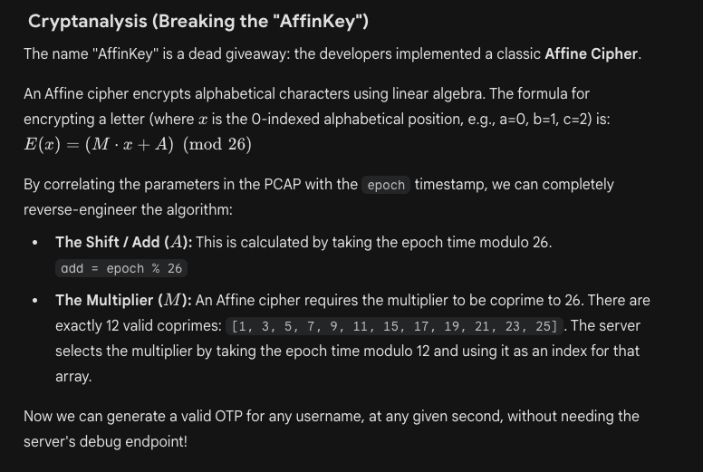

# Time to Pretend — Pico CTF 2026

> **Room / Challenge:** Time to Pretend (Web)

---

## Metadata

- **CTF:** Pico CTF 2026
- **Challenge:** Time to Pretend (web)
- **Target / URL:** `challenge.utctf.live:9382`

---

## Goal

Get the correct otp for the correct user to get the flag.

## My Solution

Visit the home page and get page source, I find this comment:

```html
<!-- NOTICE to DEVS: login currently disabled, see /urgent.txt for info -->
```

`/urgent.txt`:

```
URGENT - READ IMMEDIATELY
=========================
TO: dev team
FROM: timothy
DATE: 2013-11-12 03:47:22

guys,

i think someone figured out the AffinKey system. i dont have time to explain everything
right now but there is a SERIOUS flaw in how we generate the OTPs. i only just realized
it tonight and i am freaking out.

i have locked every account in the system except mine while we figure this out. DO NOT
unlock anyone until we have patched this. i dont care if users complain. i dont care if
chad emails again. nobody gets in.

my account stays active because i need access to keep monitoring the situation. if you
need to reach me use signal.

do NOT roll back the auth system yet - i need to look at the logs first to see if anyone
has already gotten in. if they have we have a much bigger problem.

i will write up a full post-mortem once i stop shaking.

do not talk to anyone about this. not on slack. not on email. definitely not on the forum.

- timothy

p.s. i know kevin is going to say "i told you so" about building this ourselves.
he was right. i don't want to hear it.
```

So we know that just `timothy` account is available currently.

The challenge provides a `.pcap` file, look through these, the server will respond JSON payload with cryptographic values, for ex:

Request:

```json
{ "username": "carrasco", "epoch": 1773290571 }
```

Response:

```json
{
  "add": 13,
  "mult": 7,
  "otp": "bnccnjbh"
}
```

We have to solve this cryptographic problem, and get the flag through `/auth` and `/portal`. I give Gemini to solve it since I'm not really good at cryptography:



Solve script:

```python
import time
import requests

BASE_URL = "http://challenge.utctf.live:9382"
TARGET_USERNAME = "timothy"

def generate_otp(username, epoch_time):
    add_val = epoch_time % 26

    mults = [1, 3, 5, 7, 9, 11, 15, 17, 19, 21, 23, 25]
    mult_val = mults[epoch_time % 12]

    otp = ""
    for char in username.lower():
        if char.isalpha():
            idx = ord(char) - ord('a')
            enc_idx = (idx * mult_val + add_val) % 26
            otp += chr(enc_idx + ord('a'))
        else:
            otp += char

    return otp

def main():
    session = requests.Session()

    current_epoch = int(time.time())
    otp = generate_otp(TARGET_USERNAME, current_epoch)

    payload = {
        "username": TARGET_USERNAME,
        "otp": otp
    }

    r_auth = session.post(f"{BASE_URL}/auth", json=payload)

    if r_auth.status_code == 200:

        r_portal = session.get(f"{BASE_URL}/portal")
        print(r_portal.text)
    else:
        print("Login failed")

if __name__ == "__main__":
    main()
```

Run the code to get flag:

```html
<div class="address-value flag">utflag{t1m3_1s_n0t_r3l1@bl3_n0w_1s_1t}</div>
const flag = 'utflag{t1m3_1s_n0t_r3l1@bl3_n0w_1s_1t}';
```
