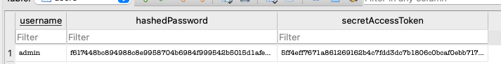
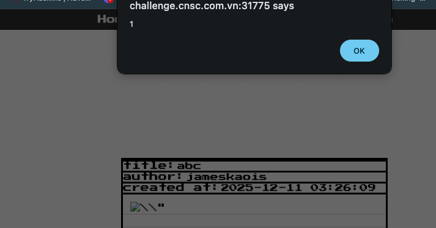

# NoteManager — SunShine CTF 2025

> **Room / Challenge:** NoteManager (Web)

---

## Metadata

- **Author:** `jameskaois`
- **CTF:** WannaGame Championship 2025
- **Challenge:** NoteManager (web)
- **Target / URL:** `https://ctf.cnsc.com.vn/games/1/challenges?challenge=22`
- **Points:** `860`
- **Solved:** `8`
- **Date:** `11-12-2025`

---

## Goal

This challenge is complex, and there are 2 ways to get the flag.

## My Solution

The intended way:

```
1. The easiest bug to spot is the leaked db file at route /sqlite/authentication.db. From there you can extract the admin secret token

2. There is a XSS vulnerability at the view note functionality, by submitting a simple note body like 

3. The challenge has an admin bot and admin dashboard, but JSESSIONID cookie by default is httpOnly so you can't get the cookie directly using XSS. In this challenge, there are two ways to access the admin dashboard:
    - Method 1: Using the XSS to perform requests on the admin's side with Fetch/XMLHttpRequest API. This is fast and much easier
    - Method 2: Note that the challenge uses Apache Tomcat 9.0.104. If you don't know, for legacy purpose Tomcat 9.0.x supports $Version cookie so that it can handle both RFC6265 and RFC2109 standards. By default, if the first cookie is $Version=1, Tomcat fallback to the legacy parsing logic. As a result it will treat the data between two double quote as the cookie value (https://github.com/apache/tomcat/blob/97f157af6d750a644a3d1c26e2d6af0d59d7b553/java/org/apache/tomcat/util/http/parser/Cookie.java#L199). In the other hand, endpoint /api/userinfo leaks total notes of the user, but this info is taking from the totalNotes cookie. With above info we can perform a cookie sandwiching attack to steal the httpOnly cookie of the admin. For more info you can read it at https://portswigger.net/research/stealing-httponly-cookies-with-the-cookie-sandwich-technique

4. After getting access to admin dashboard, you can notice that it allows users to update site configs. The field dbIntegrityHelper of the site is declared with @JsonTypeInfo annotation which allow polymorphic deserialization of the object. By abusing it you can trick the server into deserializing any class with json body.

5. There is a note cleanup feature in the site config. When the task is activated, it casts dbIntegrityHelper into  net.sf.ehcache.transaction.manager.TransactionManagerLookup, then call method getTransactionManager(). If you look at the classpath you will notice the existence of ehcache-2.9.0.jar, which is vulnerable to CVE-2019-14379. There is no available PoC for the CVE, but if you dive into the source code you will see that there is a class called SubTypeValidator that prevent deserialization of many dangerous classes, but the blacklist has some holes. It allows you to deserialize net.sf.ehcache.transaction.manager.DefaultTransactionManagerLookup, where getTransactionManager() perform a LDAP lookup.

6. JDK versions <= 1.8.121 still allow arbitrary LDAP lookup and implicit deserialization of untrusted codebase. By using the above deserialization bug, you can make the server to perform LDAP lookup to your controlled LDAP server and got arbitrary class loading.

7. NoteSecurityManager prevents command execution using some method like java.lang.Runtime.getRuntime.exec(), ... But it is only triggered under some conditions. You can use reflection to bypass the check, or simply set it to null
```

### 1. Get the admin secret token through `authentication.db`

Using DB Browser to get the admin secret token:


```
5ff4eff7671a861269162b4c7fdd3dc7b1806c0bcaf0ebb717b35899f603efff
```

### 2. Leveraging XSS vulnerability

Tried submitting a body:

```

```


It works!!

```

```
